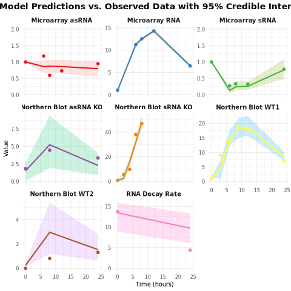
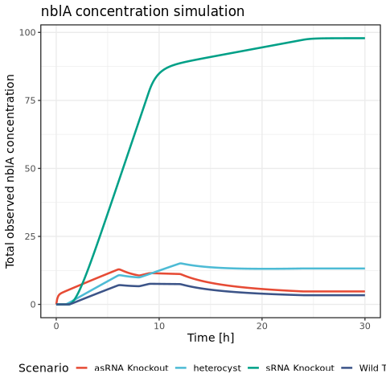

# Bayesian-modeling-of-nblA-regulation

This repository contains a Stan model for fitting a system of ordinary differential equations (ODEs) that describe the dynamics of the *nblA* (RNA), as_nblA (asRNA), and NsrR1 (sRNA) regulatory system. The model is fitted to various experimental datasets, including microarray time-series data, Northern blot data, and RNA decay rates. The repository also includes R scripts to process the fitted model, visualize the results, and run new simulations for different biological scenarios.

## Model Description

The Stan model implements a four-state ODE system:
1.  `RNA_free`: Unbound nblA concentration.
2.  `RNA_complex_sRNA`: nblA/NsrR1 complex concentration.
3.  `asRNA_free`: Unbound as_nblA concentration.
4.  `sRNA_free`: Unbound NsrR1 concentration.

## Getting Started

### Prerequisites

* R environment
* Stan (`rstan` package)
* Required R libraries: `ggplot2`, `dplyr`, `tidyr`, `deSolve`

### Required R-packages

Install the necessary R packages.

    ```R
    install.packages(c("rstan", "ggplot2", "dplyr", "deSolve", "tidyr"))
    ```

### Usage

Load the model, define the fiting data and start the stan modeling
   ```R
library(rstan)
source("model.r")

# data

obs_times       <- c(0, 6, 8, 12, 24)
obs_RNA         <- c(1, 11.23555901, 12.55334557, 14.32040113, 6.453134074)
obs_asRNA       <- c(1, 1.180992661, 0.590496331, 0.726986259, 0.946057647)
obs_sRNA        <- c(1, 0.271683716, 0.332171454, 0.320856474, 0.77916458)
n_obs           <- length(obs_times)

decay_obs_times <- c(0, 24)
obs_RNA_decay   <- c(13.73, 4.4)
n_decay_obs     <- length(decay_obs_times)

nb_times_srna_ko <- c(0, 2, 4, 6, 8)
obs_RNA_nb_srna_ko <- c(1, 5.76018571, 9.76801526, 38.1105133, 46.8838844)
n_obs_nb_srna_ko <- length(nb_times_srna_ko)

nb_times_wt1 <- c(0, 3, 6, 9, 12, 24)
obs_RNA_nb_wt1 <- c(1, 9, 14, 19, 18, 7)
n_obs_nb_wt1 <- length(nb_times_wt1)

nb_times_wt2 <- c(0, 8, 24)
obs_RNA_nb_wt2 <- c(1.0615e-11, 0.80544218, 1.30858618)
n_obs_nb_wt2 <- length(nb_times_wt2)

nb_times_asrna_ko <- c(0, 8, 24)
obs_RNA_nb_asrna_ko <- c(1.82039604, 4.46959099, 3.34963486)
n_obs_nb_asrna_ko <- length(nb_times_asrna_ko)

k_off_lit_estimate <- 18000
k_off_lower_bound <- 1080
k_off_upper_bound <- 36000

k_off_log_mean_lit_val <- log(k_off_lit_estimate)
k_off_log_sd_lit_val <- (log(k_off_upper_bound) - log(k_off_lower_bound)) / (2 * qnorm(0.975))

t0 <- 0

y0_data <- c(10.96, 3, 117.91, 62.84)

fix_y0 <- 0
sRNA_strategy <- 2

rna_ts          <- c(0, 9, 24)
rna_vals_data   <- c(1, 10.88888889, 15.77777778)
n_RNA           <- length(rna_ts)

asrna_ts          <- c(0, 9, 24)
asrna_vals_data   <- c(1, 1.180992661, 0.946057647) * 102.2222222
n_asRNA           <- length(asrna_ts)

srna_ts <- c(0, 6, 8, 12, 24)
n_sRNA  <- length(srna_ts)

L <- n_RNA + n_asRNA + n_sRNA

kd_estimate_nls <- 117.4665
ci_lower_nls <- 96.13608
ci_upper_nls <- 143.16898

z_score_95 <- qnorm(0.975)

mu_log_Kd_prior_val <- mean(c(log(ci_lower_nls), log(ci_upper_nls)))
sigma_log_Kd_prior_val <- (log(ci_upper_nls) - log(ci_lower_nls)) / (2 * z_score_95)


stan_data <- list(
  n_obs             = n_obs,
  obs_times         = obs_times,
  obs_RNA           = obs_RNA,
  obs_asRNA         = obs_asRNA,
  obs_sRNA          = obs_sRNA,
  n_decay_obs       = n_decay_obs,
  decay_obs_times   = decay_obs_times,
  obs_RNA_decay     = obs_RNA_decay,

  n_obs_nb_wt1      = n_obs_nb_wt1,
  nb_times_wt1      = nb_times_wt1,
  obs_RNA_nb_wt1    = obs_RNA_nb_wt1,
  n_obs_nb_srna_ko  = n_obs_nb_srna_ko,
  nb_times_srna_ko  = nb_times_srna_ko,
  obs_RNA_nb_srna_ko= obs_RNA_nb_srna_ko,
  n_obs_nb_wt2      = n_obs_nb_wt2,
  nb_times_wt2      = nb_times_wt2,
  obs_RNA_nb_wt2    = obs_RNA_nb_wt2,
  n_obs_nb_asrna_ko = n_obs_nb_asrna_ko,
  nb_times_asrna_ko = nb_times_asrna_ko,
  obs_RNA_nb_asrna_ko = obs_RNA_nb_asrna_ko,

  fix_y0            = fix_y0,
  y0_data           = y0_data,
  t0                = t0,
  sRNA_strategy     = sRNA_strategy,
  n_RNA             = n_RNA,
  rna_ts            = rna_ts,
  n_asRNA           = n_asRNA,
  asrna_ts          = asrna_ts,
  n_sRNA            = n_sRNA,
  srna_ts           = srna_ts,
  L                 = L,
  rna_vals_data     = rna_vals_data,
  asrna_vals_data   = asrna_vals_data,

  kd_srna_log_mean_prior = mu_log_Kd_prior_val,
  kd_srna_log_sd_prior = sigma_log_Kd_prior_val,
  
  k_off_log_mean_lit = k_off_log_mean_lit_val,
  k_off_log_sd_lit = k_off_log_sd_lit_val
)

# run the model
fit <- sampling(stan_model_fit,
                data = stan_data,
                iter = 30,
                chains =4,
                control = list(adapt_delta = 0.90,
                max_treedepth = 14)
)
							   

```
## Plot the fit to the data

  ```R
source("plot_fits_to_data.r")
```




## Simulate *nblA* expression at different scenarios

The script extracts the modeled parameters from the fit object and uses `deSolve` to simulate the *nblA* concentration in the WT, the Δas_nblA strain, the ΔnsrR1 strain and in heterocysts.
Download the precomputed fit object fro

  ```R
load("fit.Rdata") # load the precomputed fit
source("simulate_nblA_expression.r")

```


