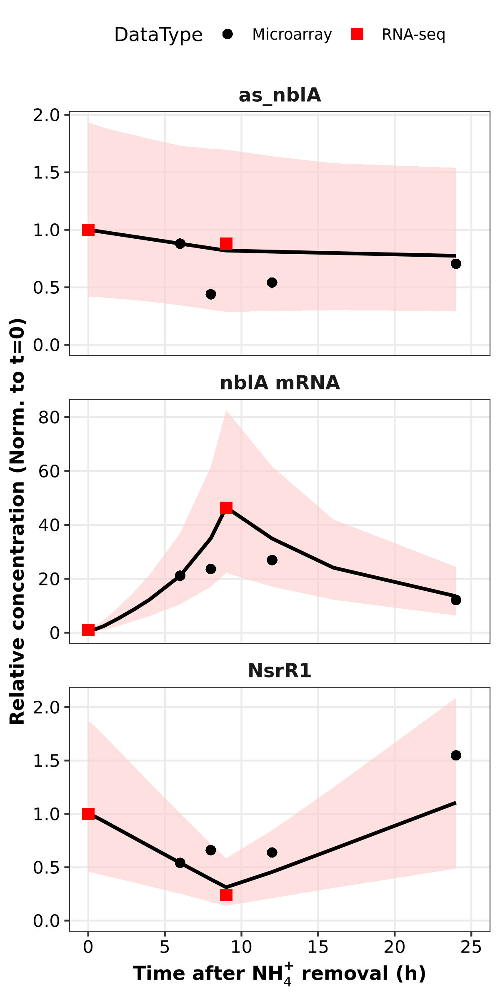
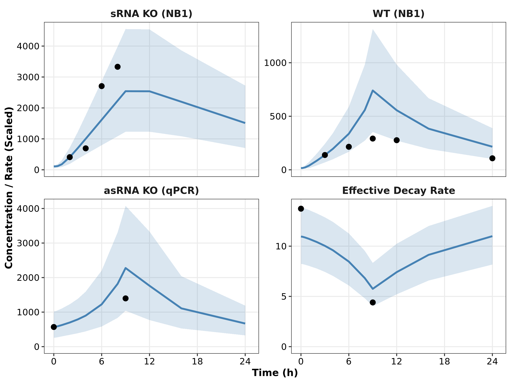
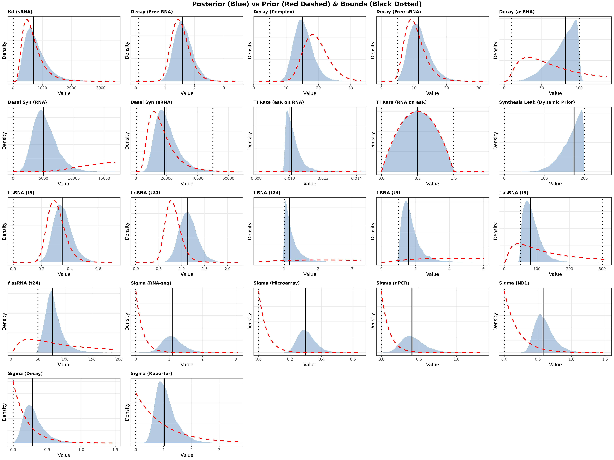
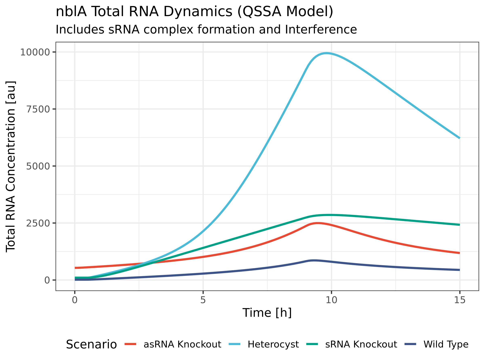

# Bayesian-modeling-of-nblA-regulation

This repository contains a Stan model for fitting a system of ordinary differential equations (ODEs) that describe the dynamics of the *nblA* (RNA), as_nblA (asRNA), and NsrR1 (sRNA) regulatory system.

The model utilizes a **Quasi-Steady-State Approximation (QSSA)** for the sRNA-mRNA complex and explicitly models **Transcriptional Interference (TI)** between the sense and antisense strands. The model is fitted to various experimental datasets, including RNA-seq ratios, microarray time-series, qPCR (Wild Type and Knockouts), and RNA decay rates using `cmdstanr`.

## Model Description

The Stan model (`qssa_model.stan`) implements a 3-state ODE system with an algebraic constraint for the rapid equilibrium of the sRNA complex:

1. **(Total nblA RNA):** Tracks total RNA abundance (free + complexed).
2. **(Total NsrR1 sRNA):** Tracks total sRNA abundance.
3. **(Total as_nblA):** Tracks antisense RNA abundance.

**Key Mechanisms:**

**QSSA:** The concentration of the sRNA-mRNA complex is calculated algebraically at each step using the mass balance and dissociation constant, assuming the binding dynamics are faster than transcription/decay.


**Transcriptional Interference (TI):** The synthesis of the sense strand is suppressed by the synthesis flux of the antisense strand (and vice versa) using a logistic interference function.


**Leak Synthesis:** Accounts for basal transcription distinct from the main regulated flux. Resembles the very low basic transcription that can be measured using RNAseq. Likely prematurely terminated RNA fragments.


**Time-Varying Synthesis:** Synthesis rates are modeled using linear interpolation between key timepoints (t=0, 9, 24) to capture dynamic regulation.


## Getting Started

### Prerequisites

* **R environment**
* **CmdStan** (via `cmdstanr`)
* **Required R libraries for modelling:** `cmdstanr`, `posterior`, `ggplot2`
* **Required R libraries for postprocessing:** `cmdstanr`, `posterior`, `ggplot2`, `dplyr`, `tidyr`, `gridExtra`, `grid`
* **Required R libraries for simulation:** `deSolve`

### Required R-packages

Install the necessary R packages. Note that `cmdstanr` requires a working C++ toolchain.

```r
install.packages(c("cmdstanr", "posterior", "ggplot2"))
library(cmdstanr)
check_cmdstan_toolchain()
install_cmdstan()

```

### Usage

The following script (`runmodel_final.R`) demonstrates how to load the data, compile the model, and run the Bayesian inference.

```r
library(cmdstanr)
library(posterior)
library(ggplot2)

# 1. Compile the Stan model
model <- cmdstan_model(
  "qssa_model.stan",
  cpp_options = list(stan_threads = FALSE),
  stanc_options = list("O1"), # Optimization level
  force_recompile = F
)

# 2. Define Experimental Data
# RNA-seq ratios
RNA_t0 <- 19.9
RNA_t9 <- 923
asRNA_t0 <- 1152
asRNA_t9 <- 1017
sRNA_t0 <- 3098  # From dRNA-seq
sRNA_t9 <- 742   # From dRNA-seq

obs_asRNA_RNA_ratio_t0 <- asRNA_t0 / RNA_t0  
obs_sRNA_RNA_ratio_t0 <- sRNA_t0 / RNA_t0 
obs_asRNA_RNA_ratio_t9 <- asRNA_t9 / RNA_t9  


#  Microarray (t > 0 only relative changes)
microarray_times <- c(6, 8, 12, 24)
obs_RNA_microarray <- c(11.24, 12.55, 14.32, 6.45)
obs_sRNA_microarray <- c(0.272, 0.332, 0.321, 0.779)
obs_asRNA_microarray <- c(1.181, 0.590, 0.727, 0.946)


#  qPCR asRNA_KO: t9/t0 fold-change AND KO/WT ratio at t9
qpcr_ko_t0 <- 1.82
qpcr_ko_t9 <- 4.47  # Interpolated from t=8 data
qpcr_wt_t9 <- 0.805

obs_asrna_ko_fc_t9_t0 <- qpcr_ko_t9 / qpcr_ko_t0 
obs_asrna_ko_wt_ratio_t9 <- qpcr_ko_t9 / qpcr_wt_t9  


# 1. WT / sRNA_KO at t=6
# NB1 Data: WT(t6)=14, sRNA_KO(t6)=38.1
obs_ratio_wt_srna_ko_t6 <- 14 / 38.1

# 2. asRNA_KO / WT at t=8
# Data: asRNA_KO(8h)=4.47, WT(8h)=0.805
obs_ratio_asrna_ko_wt_t8 <- 4.47 / 0.805

# 3. asRNA_KO / WT at t=24
# Data: asRNA_KO(24h)=3.35, WT(24h)=1.31
obs_ratio_asrna_ko_wt_t24 <- 3.35 / 1.31

# NB1 sRNA_KO: relative to t=2 
# Original data: t=0,2,4,6,8 -> 1, 5.76, 9.77, 38.1, 46.9
# Fold-change from t=2:
nb1_srna_ko_times <- c(4, 6, 8) 
nb1_srna_ko_fc_t2 <- 5.76  
obs_RNA_srna_ko_fc_from_t2 <- c(9.77, 38.1, 46.9) / nb1_srna_ko_fc_t2  


# NB1 WT: relative to t=3 
# Original data: t=0,3,6,9,12,24 -> 1, 9, 14, 19, 18, 7
# Fold-change from t=3:
nb1_wt_times <- c(6, 9, 12, 24)
nb1_wt_fc_t3 <- 9 
obs_RNA_nb1_wt_fc_from_t3 <- c(14, 19, 18, 7) / nb1_wt_fc_t3  


# Decay measurements 
obs_RNA_decay <- c(13.73, 4.4)
decay_times <- c(0, 9)


# Decay ratio 
obs_decay_ratio <- 1.5
sigma_decay_ratio <- 0.15

# GFP Reporter 
f_RNA_9_data <- 10.88888889
f_asRNA_9_data <- 120.7 
f_asRNA_24_data <- 96.7 


solver_times <- c(0.2,0.5,1,2, 3, 4, 6, 8, 9, 12,16, 24)
n_solver <- length(solver_times)

# Find indices for key timepoints
get_time_idx <- function(t, times) which.min(abs(times - t))

srna_ko_t2_idx <- get_time_idx(2, solver_times)
wt_t3_idx <- get_time_idx(3, solver_times)

microarray_time_idx <- sapply(microarray_times, get_time_idx, solver_times)
nb1_srna_ko_time_idx <- sapply(nb1_srna_ko_times, get_time_idx, solver_times)
nb1_wt_time_idx <- sapply(nb1_wt_times, get_time_idx, solver_times)
decay_time_idx <- c(0, get_time_idx(9, solver_times))  # 0 = use y0, otherwise index


# 3. Structure Data for Stan
stan_data <- list(
  n_solver = n_solver,
  solver_times = solver_times,
  t0 = 0,
  
  # RNA-seq ratios
  obs_asRNA_RNA_ratio_t9 = obs_asRNA_RNA_ratio_t9,
  
  # Microarray
  n_microarray = length(microarray_times),
  microarray_time_idx = microarray_time_idx,
  obs_RNA_microarray = obs_RNA_microarray,
  obs_sRNA_microarray = obs_sRNA_microarray,
  obs_asRNA_microarray = obs_asRNA_microarray,
  
  # qPCR asRNA_KO
  obs_asrna_ko_fc_t9_t0 = obs_asrna_ko_fc_t9_t0,
  obs_asrna_ko_wt_ratio_t9 = obs_asrna_ko_wt_ratio_t9,
  
  # t=0 Ratios RNAseq & dRNAseq
  obs_asRNA_RNA_ratio_t0 = obs_asRNA_RNA_ratio_t0,
  obs_sRNA_RNA_ratio_t0  = obs_sRNA_RNA_ratio_t0,
  
  # NB1 sRNA_KO (relative to t=2)
  n_nb1_srna_ko = length(nb1_srna_ko_times),
  nb1_srna_ko_time_idx = nb1_srna_ko_time_idx,
  obs_RNA_srna_ko_fc_from_t2 = obs_RNA_srna_ko_fc_from_t2,
  srna_ko_t2_idx = srna_ko_t2_idx,
  
  # NB1 WT (relative to t=3)
  n_nb1_wt = length(nb1_wt_times),
  nb1_wt_time_idx = nb1_wt_time_idx,
  obs_RNA_nb1_wt_fc_from_t3 = obs_RNA_nb1_wt_fc_from_t3,
  wt_t3_idx = wt_t3_idx,
  
  # Decay
  n_decay_obs = 2,
  decay_time_idx = decay_time_idx,
  obs_RNA_decay = obs_RNA_decay,
  
  # Decay ratio
  decay_ratio_time_idx = get_time_idx(9, solver_times),
  obs_decay_ratio = obs_decay_ratio,
  sigma_decay_ratio = sigma_decay_ratio,
  
  # GFP Reporter
  f_RNA_9_data = f_RNA_9_data,
  f_asRNA_9_data = f_asRNA_9_data,
  f_asRNA_24_data = f_asRNA_24_data,
  
  obs_ratio_wt_srna_ko_t6 = obs_ratio_wt_srna_ko_t6,
  obs_ratio_asrna_ko_wt_t8 = obs_ratio_asrna_ko_wt_t8,
  obs_ratio_asrna_ko_wt_t24 = obs_ratio_asrna_ko_wt_t24
)


# 4. Run Sampling
fit <- model$sample(
  data = stan_data,
  chains = 8,
  parallel_chains = 8,
  iter_warmup = 2000,
  iter_sampling = 2000,
  refresh = 10,
  adapt_delta = 0.95,
  max_treedepth = 15,
  seed = 42
)

```

---

## Plot posterior trajectories to data

```r
source(trajectory_plot.R)
```

---


---

## Plot and extract prameter posteriors 

```r
source(plot_and_extract_posteriors.R)
```


---
## Simulate nblA expression based on posterior parameters

```r
source(simulate_nblA_expression.r)
```

---
